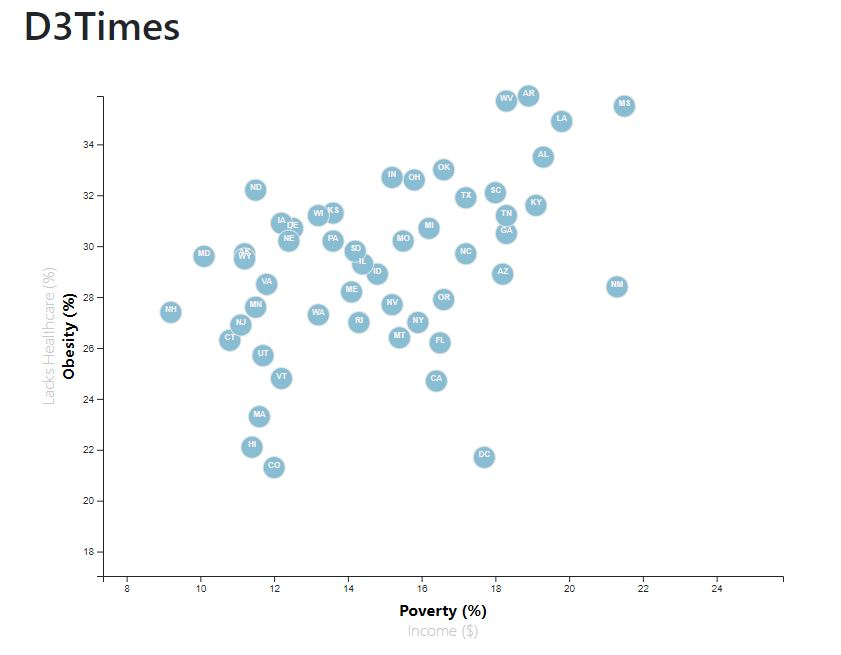

# D3-Challenge

## Background

Census data was analyzed for correlations between various parameters, including income, obesity, poverty, etc across the states of the U.S.

D3, Javascript, and HTML were used to build an interactive scatterplot, allowing for the analysis of 4 separate variables.

## Results

Correlations can be clearly seen between levels of obesity, poverty, income, and healthcare. 

The variables can be interactively chosen by clicking on the axis name in your browser. The plot will automatically update to reflect the chosen variables. Each data point is labeled w/ the corresponding state abbreviation.

## Data Source

https://factfinder.census.gov/faces/nav/jsf/pages/searchresults.xhtml